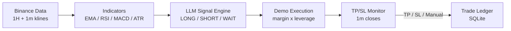
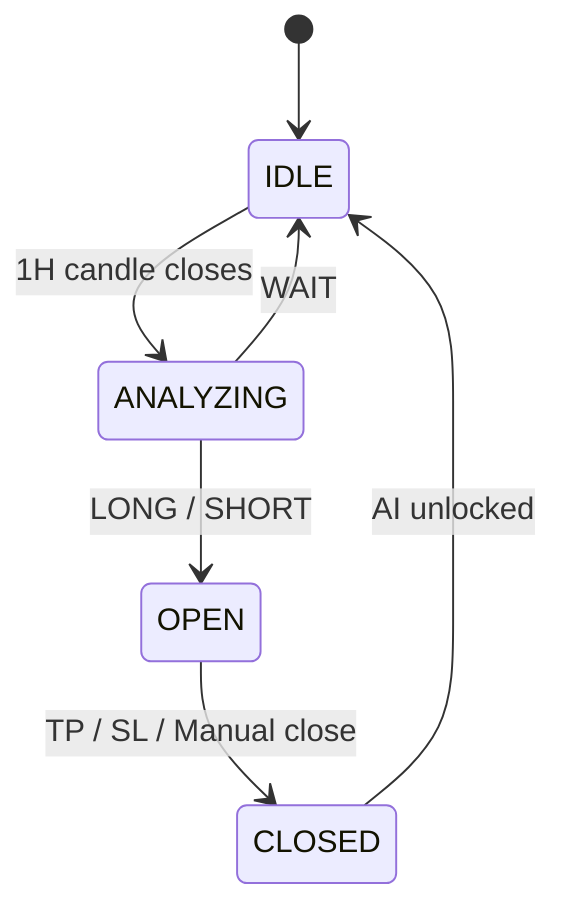

<p align="center">
  
</p>

# NEXTRA AI — BTC Signal & Demo Trading System (Binance Futures)

An AI-powered signal generation and **simulated (DEMO)** trading system for
Binance USDT-M Futures, built on top of TradingAgents. It analyzes the market
with an LLM, emits LONG / SHORT / WAIT signals with entry, take-profit and
stop-loss levels, simulates execution on a demo ledger, and monitors every open
position until TP or SL — all through a web dashboard.

> Research only: this system generates signals and simulates trades. It does
> not guarantee win rates or returns, and **no real-money order execution is
> implemented or enabled**.

## Features

- **AI signal engine (1H)** — LLM analysis on closed 1H candles only; emits
  LONG / SHORT / WAIT with entry, TP, SL and confidence.
- **Signal guardrails** — minimum confidence, minimum risk/reward, fee-aware TP
  (TP must cover fees ×2), ATR-bounded SL/TP, pending-signal expiry.
- **Veto filters** — macro-event blackout (FOMC/CPI/NFP), crowded-positioning
  veto (funding rate, long/short ratio), 4H trend-bias veto.
- **TP/SL monitor (1m)** — watches open positions on 1m candles, independent
  of the 1H analysis cycle; closes at market on first touch.
- **Demo ledger** — configurable balance, margin per trade, leverage, risk %,
  fee rate; full trade history with gross/net PnL, win rate, drawdown.
- **Manual close ("Chốt")** — close any OPEN position at market price from the
  dashboard; recorded as a manual TP/SL with PnL and balance update.
- **Multi-symbol (Phase B′)** — one port, one database, one shared demo
  account; one daemon per symbol (`BTCUSDT`, `ETHUSDT`, ...), max concurrent
  positions cap, per-symbol single-active rule.
- **Web dashboard** — positions, portfolio, price chart with Entry/TP/SL
  overlay, signals, trades (leverage, opened/closed time), statistics, daemon
  log, macro-event calendar, quota statistics, and a Settings page (EN/VI,
  light/dark). Dependency-free: stdlib HTTP server + vanilla JS.
- **Telegram** — trade lifecycle messages to a signals channel plus a daily
  P&L report to a reports channel.
- **Backtesting** — no look-ahead bias; same-candle TP/SL ambiguity resolved
  with lower-timeframe data.
- **Persistence & recovery** — SQLite is the source of truth; after a restart
  the daemon resumes monitoring open positions without re-analyzing.

## Architecture





| Directory        | Responsibility                                              |
|------------------|-------------------------------------------------------------|
| `binance/`       | Public market data, indicators, positioning, 4H trend       |
| `signal_engine/` | Scheduler, validator, state machine, monitor, LLM providers |
| `demo/`          | Demo account, positions, executor, statistics               |
| `backtest/`      | Backtest engine and metrics                                 |
| `database/`      | SQLite persistence (signals, positions, trades, settings)   |
| `web/`           | Dashboard server + static single-page app                   |
| `notification/`  | Telegram notifiers                                          |

Core rules (see `AGENTS.md`): at most **one active signal per symbol** (AI is
locked while a position is OPEN); entry/TP/SL are **immutable** once OPEN;
DEMO never touches real money or trading API keys.

## Quickstart (local)

```bash
python -m venv .venv && source .venv/bin/activate
pip install -r requirements.txt
cp .env.example .env          # add your LLM provider key
```

**Single symbol** — daemon in one terminal, dashboard in another:

```bash
python -m signal_engine                       # daemon (blocks, Ctrl-C stops)
python -m signal_engine web                   # dashboard http://127.0.0.1:8000
```

**Multi-symbol** — one dashboard, one daemon per symbol:

```bash
./run-symbols.sh sync      # start daemons for the enabled symbols
./run-symbols.sh status    # process + position table
./run-symbols.sh stop      # stop all (blocked while positions are OPEN)
```

**One-shot / inspect** (cron, CI, debugging):

```bash
python -m signal_engine --once
python -m signal_engine status    # daemon health + active signal
python -m signal_engine signals   # recent signals
python -m signal_engine active    # the active signal (PENDING_ENTRY / OPEN)
python -m signal_engine demo      # demo account, trades, statistics
python -m signal_engine health    # exit 0 only when alive
```

## Deploy via Docker (daemon + dashboard, one container)

```bash
git clone <repo-url> TradingAgents && cd TradingAgents
cp .env.example .env            # then edit the provider section
docker compose up -d --build
docker compose ps               # signalengine: running (healthy)
curl http://localhost:8000/api/health
# Dashboard -> http://SERVER:8000
```

The `btcusdt_data` volume (`/app/data`) holds the SQLite ledger and the
`0600` secrets file, so balance, history and OPEN positions survive rebuilds.
For the full pull-without-data-loss procedure see [`DEPLOY.md`](DEPLOY.md).
For a beginner-friendly tour of every tab and button see
[`USERGUIDE.md`](USERGUIDE.md).

**Choose one AI provider in `.env`:**

| Provider   | Settings                                                             |
|------------|----------------------------------------------------------------------|
| Ollama     | `BTCUSDT_LLM_PROVIDER=ollama`, model `qwen3:4b`, host reachable URL  |
| DeepSeek   | `BTCUSDT_LLM_PROVIDER=deepseek` + API key                            |
| OpenRouter | `BTCUSDT_LLM_PROVIDER=openrouter`, model id + `OPENROUTER_API_KEY`   |

Settings saved on the Dashboard Settings page take precedence over `.env`
(priority: database > env > defaults) and apply to future analyses only.
Demo/balance settings are refused while a position is active.

## Configuration

All tunables live in `.env` (documented in `.env.example`):

- **LLM** — `BTCUSDT_LLM_PROVIDER`, `BTCUSDT_LLM_MODEL`, timeouts/retries.
- **Guardrails** — `BTCUSDT_MIN_CONFIDENCE`, `BTCUSDT_MIN_RISK_REWARD`,
  `BTCUSDT_FEE_RATE`, `BTCUSDT_PENDING_EXPIRY_HOURS`, ATR bounds.
- **Vetoes** — `BTCUSDT_MAX_FUNDING_RATE`, `BTCUSDT_HTF_BIAS`,
  `BTCUSDT_EVENT_WARN_HOURS`.
- **Demo** — `BTCUSDT_DEMO_*` (defaults: 1000 USDT balance, 50 USDT margin,
  10x leverage, 1% risk, 0.04% fee).
- **Telegram** — `BTCUSDT_TELEGRAM_*` (bot token, signals/reports chat IDs).
- **Runtime** — `BTCUSDT_SYMBOL`, `BTCUSDT_TIMEFRAME`, `BTCUSDT_DB_PATH`,
  scheduler/monitor poll intervals, `MAX_OPEN_POSITIONS`.

## Tests

```bash
python -m pytest -q        # ~1900 tests: signals, TP/SL, PnL, demo, state, backtest, web API
ruff check .               # lint
```

Every trading-critical calculation is covered: LONG/SHORT validation, WAIT
behavior, duplicate-OPEN prevention, TP/SL hits, fee and net PnL, balance
updates, restart recovery, and no-look-ahead backtests.

## Upstream credit

This project extends
[TradingAgents](https://github.com/TauricResearch/TradingAgents) (multi-agent
LLM financial framework) into a Binance Futures AI signal and demo-trading
system. The original stock-analysis framework is no longer the focus; only the
agent/LLM foundations are reused via adapters.

```
@misc{xiao2025tradingagentsmultiagentsllmfinancial,
      title={TradingAgents: Multi-Agents LLM Financial Trading Framework},
      author={Yijia Xiao and Edward Sun and Di Luo and Wei Wang},
      year={2025},
      eprint={2412.20138},
      archivePrefix={arXiv},
      primaryClass={q-fin.TR},
      url={https://arxiv.org/abs/2412.20138},
}
```

## Contributing

Bug fixes, documentation, and feature ideas are welcome; see
[`CHANGELOG.md`](CHANGELOG.md) and the phased plan in
`.opencode/plans/btcusdt-signal-engine.md`.
